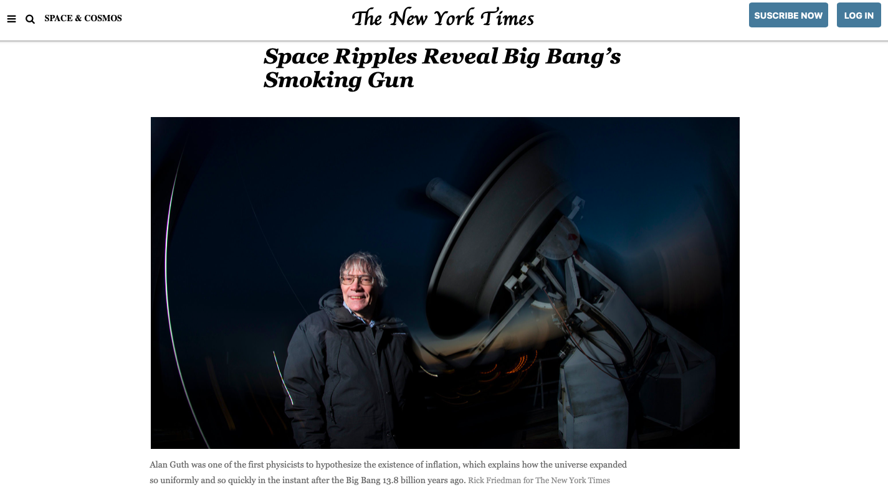
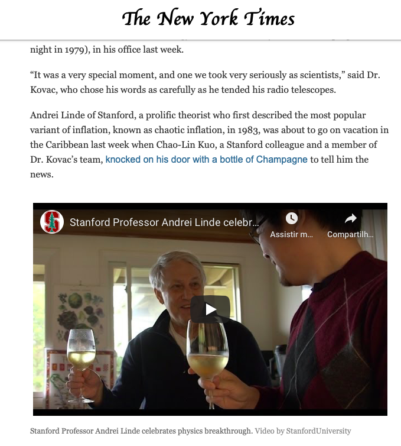
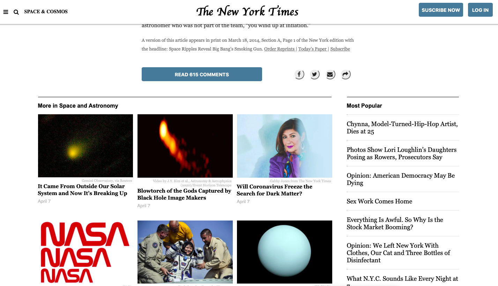
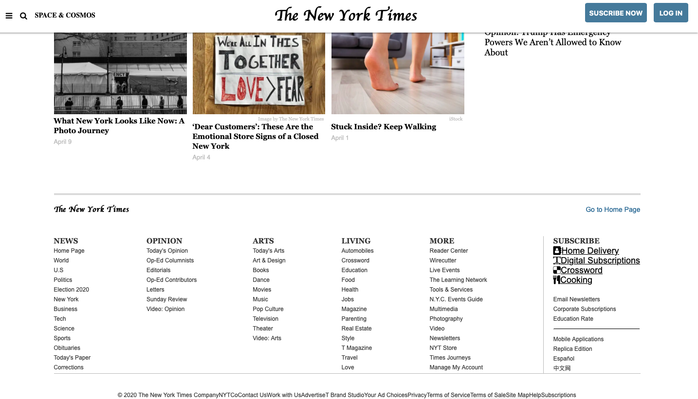

# NYT-Page-Clone
- In this project, our assignment consists of making a clone of a New York Times article page (https://www.nytimes.com/2014/03/18/science/space/detection-of-waves-in-space-buttresses-landmark-theory-of-big-bang.html?_r=0). As usual, we ignored any ads, comments or interactive elements so don’t worry about what happens when you change the page width. The Focus is on making it look similar.





## LIVE DEMO
https://rawcdn.githack.com/brugobi/NYT-Page-Clone/43d3d715c76aa73902156f693a349d7e0ac8dd74/index.html
## Built With
- HTML & CSS;
```Branch is on feature```
## Authors
:bust_in_silhouette: **Jasemm Duncan**
- Github: [@JasemDuncan](https://github.com/JasemDuncan)
- Twitter: [@JasemValencia](https://twitter.com/JasemValencia)
- Linkedin: [linkedin](https://www.linkedin.com/in/jasem-duncan-valencia/
)
:bust_in_silhouette: **Bruna Gobi**
- Github: [@brugobi](https://github.com/brugobi)
- Twitter: [@BrunaGobi2](https://twitter.com/BrunaGobi2)
- Linkedin: [linkedin](https://www.linkedin.com/in/bruna-gobi-08854760/)


